# Autonomous Remote Monitoring System (LoRaWAN)

Solar-powered agricultural weather station built from scratch: three custom PCBs, three MCUs, Modbus RTU over RS-485 between boards, LoRaWAN uplink to a private ChirpStack network server. Verified 4.3 km link in suburban terrain.

Bachelor's thesis project, Poznan University of Technology, 2026.

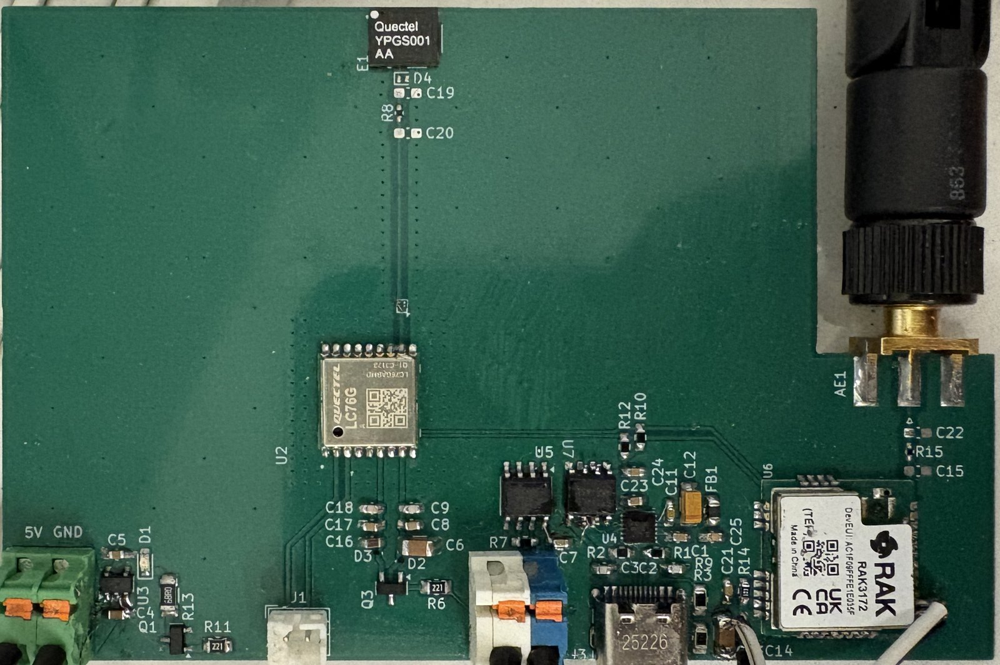

---

## What it does

A field station measures temperature, humidity, pressure and ambient light, runs entirely off a 30 W solar panel with a 3S LiFePO4 pack, and reports over LoRaWAN to a self-hosted network server. No GSM, no mains power, no cloud dependency.

| | |
|---|---|
| **Boards designed** | 3 (two 4-layer, one 2-layer), schematic → routing → assembly → bring-up |
| **Bare-metal drivers written** | 5, from IC datasheets: BMP390, SHT45, VEML7700, BQ25798, BQ76952 |
| **Verified LoRa range** | 4.3 km, suburban terrain, low-mounted gateway |
| **Inter-board protocol** | Modbus RTU over RS-485, master–slave, expandable to 32 nodes |
| **MCUs** | STM32WLE5CC (RAK3172 master), 2× STM32G030F6 (slaves) |

---

## System architecture

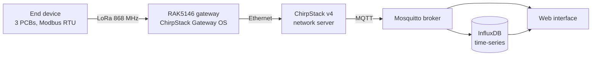

### End device

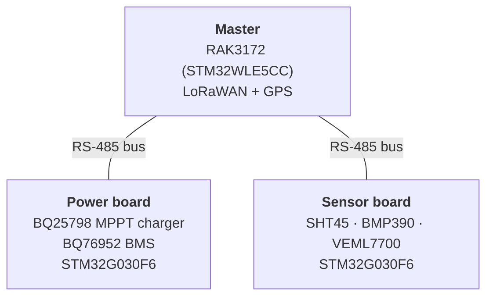

The split into three boards is deliberate: each module is reusable on its own, and new slaves can be added to the bus without touching the existing hardware.

---

## Hardware

### Wireless transceiver — master (4-layer)

RAK3172 (STM32WLE5CC) running the LoRaWAN stack and mastering the Modbus bus, plus a Quectel LC76GABMD GNSS receiver. USB-C to UART via FT234XD behind an STISO621 optoisolator for bench work, SP3485EN for the RS-485 side, TLV75533 LDO.

| Top | Bottom | Assembled |
|---|---|---|
| 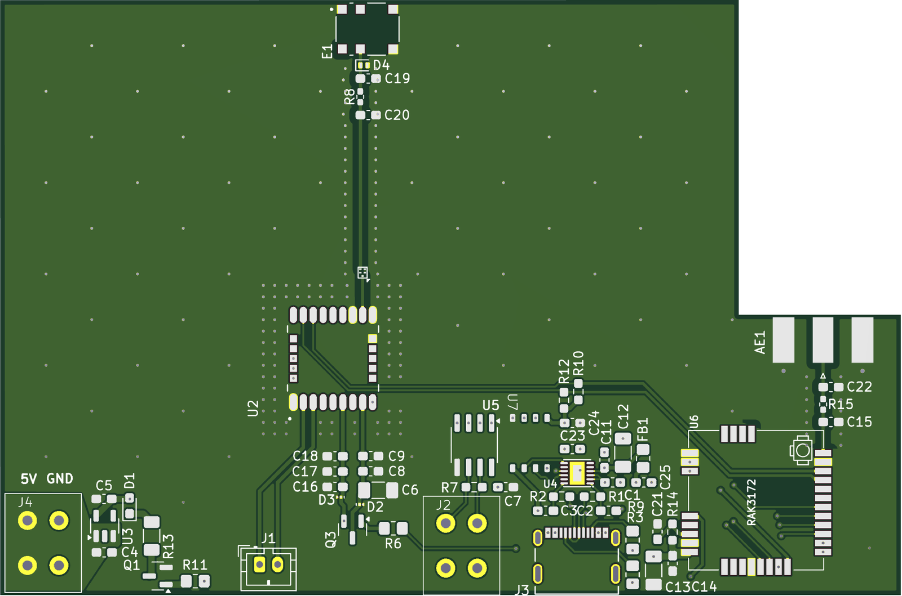 | 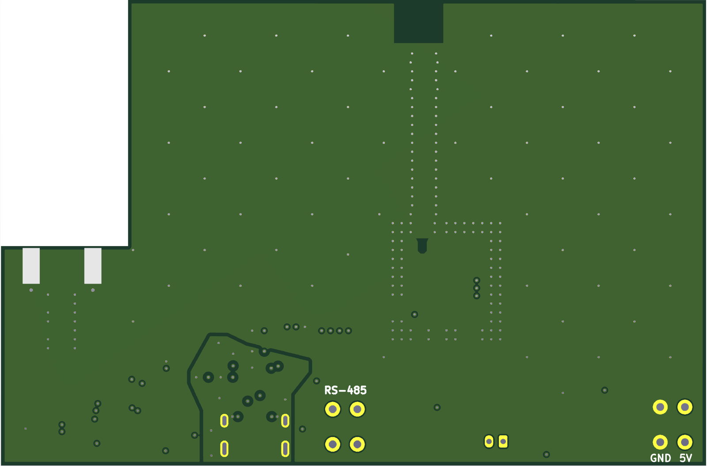 |  |

Both antennas are fed by 50 Ω controlled-impedance traces — 0.3493 mm width computed for the JLCPCB FR-4 stackup, with a pi network at each antenna for fine tuning. The GNSS feed runs up the centre of the board inside a via fence, with the SMD antenna (E1) at the top edge and the whole area kept clear of copper on the layer below. The RAK3172 sits in the opposite corner with its own SMA feed, so the two RF chains never share a return path. Power electronics and high-current traces are pushed as far from both as the outline allows.

Schematics: [RAK3172 and peripherals](docs/schematics/transceiver-rak3172.svg) · [GNSS section](docs/schematics/transceiver-gps.svg)

### Power electronics — slave (4-layer)

BQ25798 buck-boost charger with MPPT harvesting from a 30 W panel into a 3S LiFePO4 pack, BQ76952 BMS, STM32G030F6 supervising both over a galvanically isolated I²C bus.

| Top | Bottom | Assembled |
|---|---|---|
| 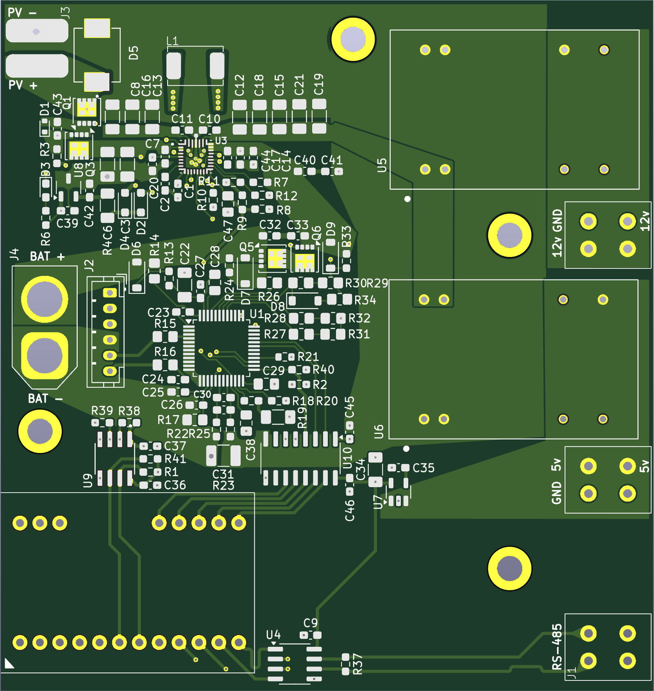 | 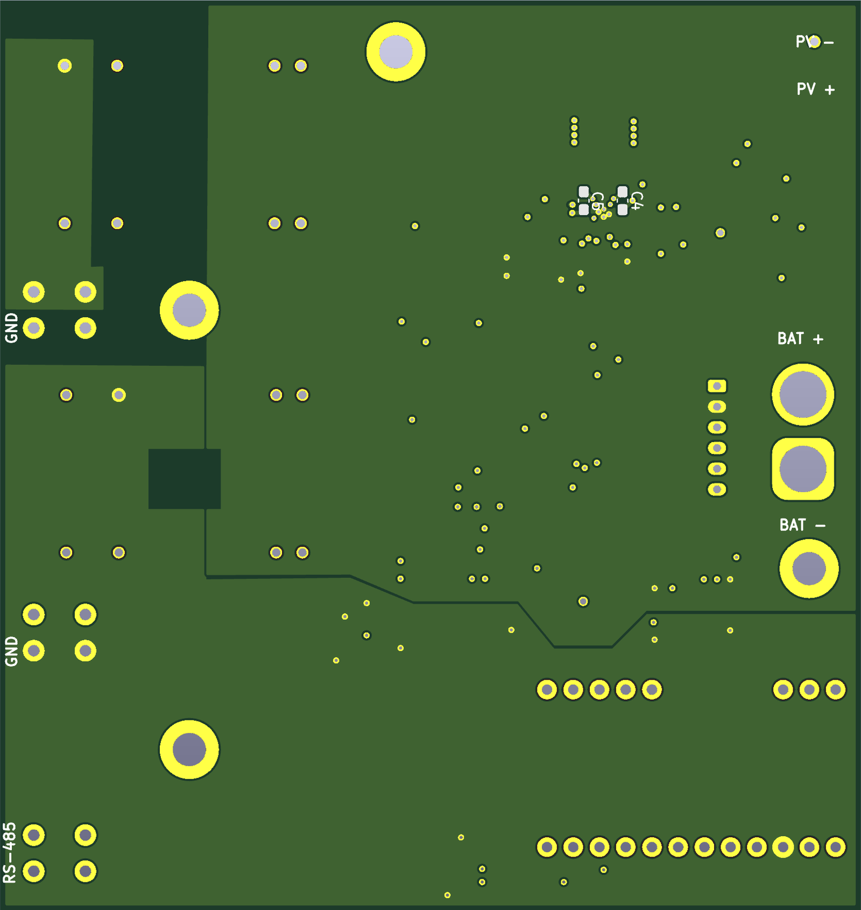 | 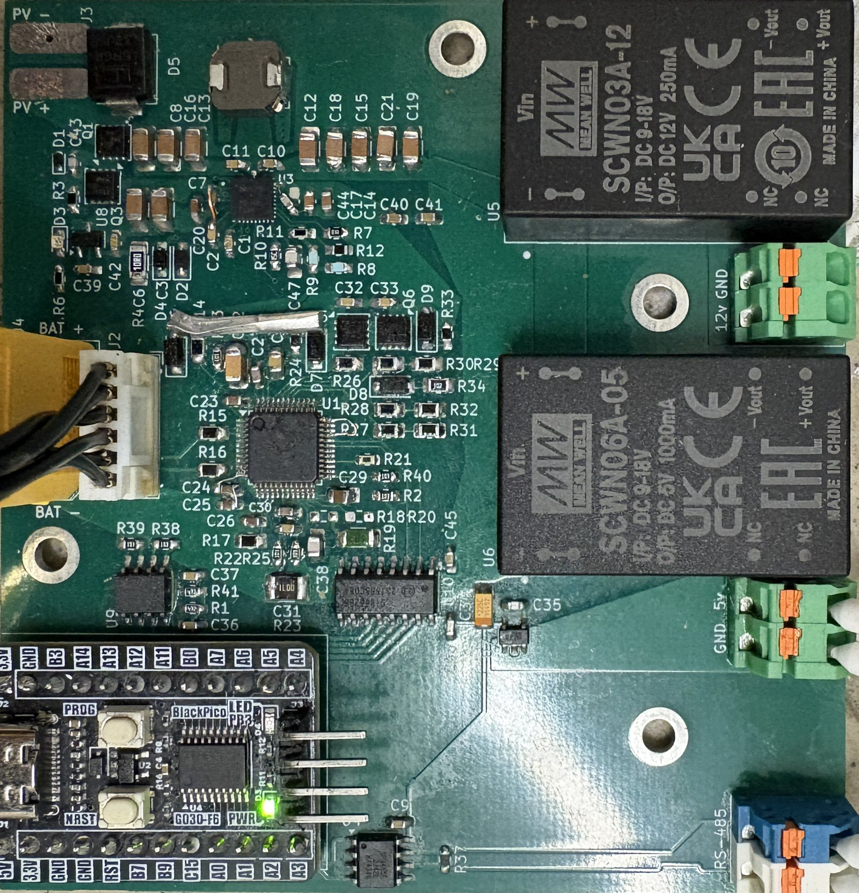 |

Two constraints drove this layout: minimise EMI, minimise high-current path length. The 2.2 µH inductor sits at the top (750 kHz switching was chosen over the 1 µH / 1.5 MHz option for better efficiency and lower EMI), decoupling caps are pulled tight to the charger's VBUS, SYS, PMID and BAT pins, and the analog and power grounds are split and joined at a single point between C10 and C11. The BMS and its circuitry are placed physically between the MCU and the charger as a buffer against the switching node. The charge and discharge FETs sit top-right of the BMS to keep pack current paths short, and the 1 mΩ shunt (R23) divides BMS ground from system ground. Everything crossing to the MCU passes through ISO1640 (I²C) and Si8662 (ALERT, INT, CE) isolators, fed by isolated 5 V and 12 V DC-DC bricks.

Schematics: [BQ25798 charger](docs/schematics/power-charger-bq25798.svg) · [BQ76952 BMS](docs/schematics/power-bms-bq76952.svg) · [MCU and isolation](docs/schematics/power-mcu-g030f6.svg)

### Data gathering — slave (2-layer)

SHT45 (±0.1 °C, ±1 %RH), BMP390 (±0.33 hPa) and VEML7700 on one I²C bus, read by an STM32G030F6 and exposed as Modbus registers. Spare GPIO is broken out to terminal blocks for wind and rain sensors.

| Top | Bottom | Assembled |
|---|---|---|
| 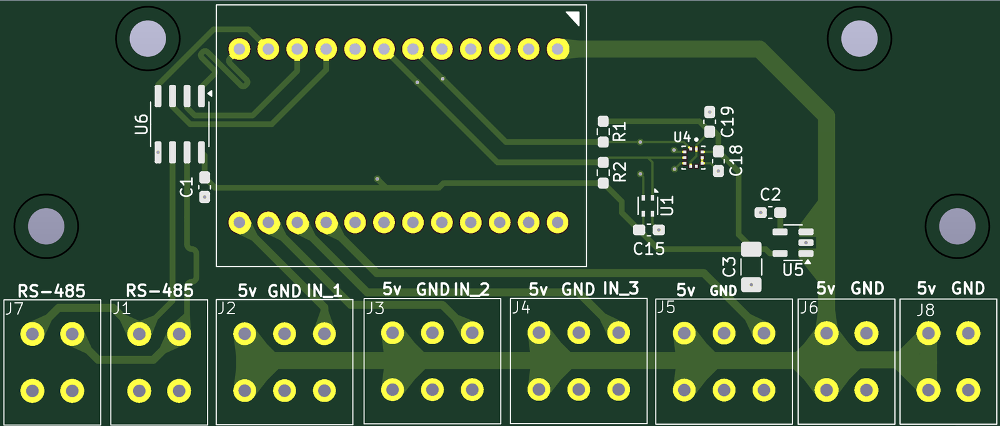 | 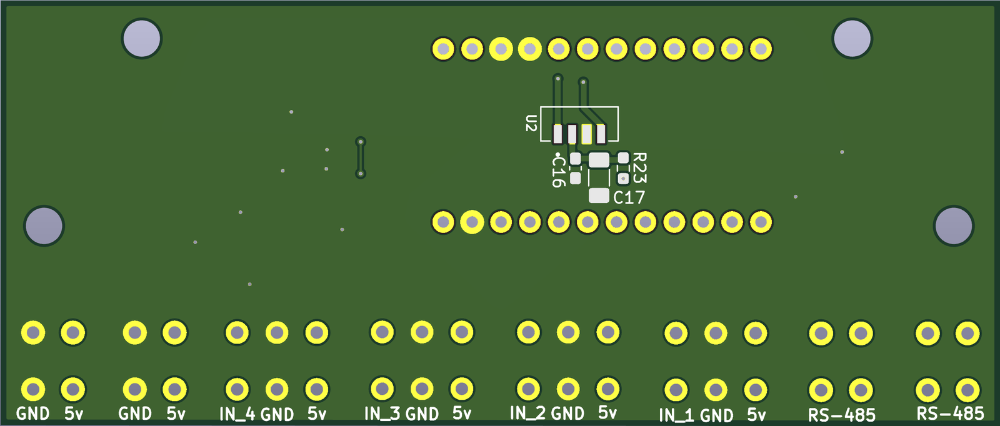 | 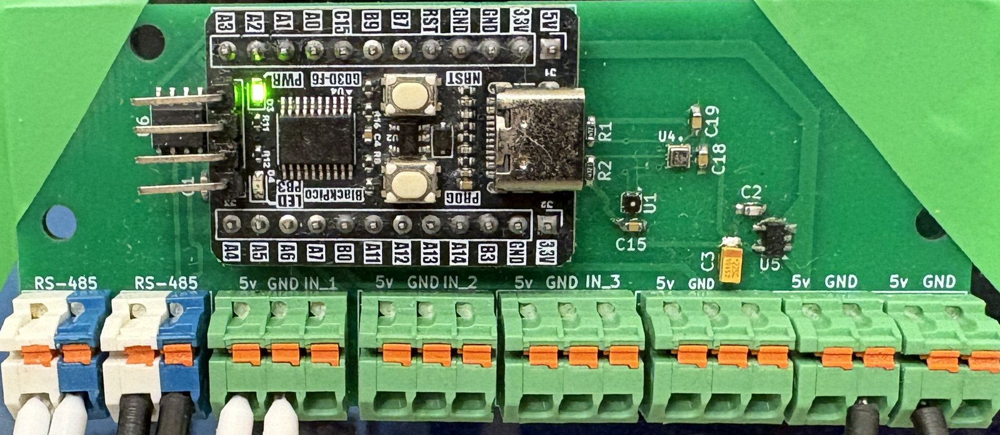 |

The VEML7700 is mounted alone on the back face; everything else lives on the front. That keeps direct sun off the SHT45, which would otherwise bias the temperature reading, and leaves the light sensor as the only protrusion on its side so the enclosure aperture can stay small. The bottom face is a solid ground pour for a continuous low-impedance return, and the LDO sits next to the terminal blocks to keep the long, EMI-prone wiring runs away from the sensor traces.

Schematic: [sensor board](docs/schematics/sensor-board.svg)

---

## Firmware

Written bare-metal against the datasheets on a CMake / `arm-none-eabi` toolchain, not inside an IDE. Each module follows the same three-way split:

```
<Module>/
├── App/          # init, control, RS-485 dock — application logic
├── Core/         # CubeMX-generated, with calls into App/
├── Drivers_IC/   # or Drivers_Sensors/ — direct IC control
└── Drivers_ModbusRTU/
```

Keeping everything outside `Core/` means CubeMX regeneration never touches hand-written code, and the drivers port to another MCU without untangling them first.

### Power module sequence

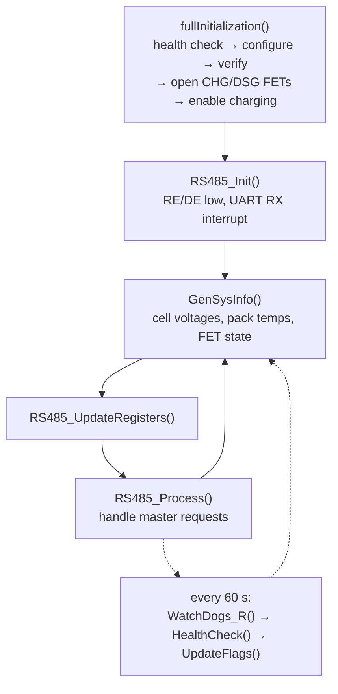

The board only comes up if the charger's VBUS is live: with the BMS FETs open, the isolated side has no power and I²C would fail, so the charger's default battery profile bootstraps the DC-DC that feeds the MCU. Initialisation then health-checks both ICs (device ID on the bus, no fault flags raised), configures them, verifies the critical registers read back correctly, and only then opens the CHG and DSG FETs so the charger sees the pack on its BAT pin.

Both ICs run hardware watchdogs with an 80 s timeout; the loop kicks them every 60 s and re-runs the same health check used at boot. Fault and status registers are mirrored into Modbus registers, so a fault on the power board propagates to the master and out over LoRa rather than silently bricking the station.

### LoRa payload

Uplinks are packed hexadecimal, not JSON — air time matters under the EU 1% duty cycle. Each payload opens with a two-byte identifier (payload class + device ID matching the Modbus address). Values are sent unscaled big-endian `uint16_t`, with signed quantities cast from `int16_t`; pressure and lux use `uint32_t`. Example: a cell voltage of 3.456 V goes out as `3456` → `0x0D80`.

| Payload ID | Contents |
|---|---|
| `0x01` | Cell voltages 1–3, pack temperature (BMS side, charger side) |
| `0x11` | VAC_1 voltage, system info, BMS current |
| `0x21`–`0x81` | Fault checks, fault flags, charger flags, BMS safety alerts/status, PF alert/status |
| `0x02` | SHT45 temperature, SHT45 humidity, BMP390 temperature |
| `0x12` | VEML7700 lux, white ratio, BMP390 pressure |

Because sensor data is split across payload classes, the decoder keeps a per-station cache and merges partial updates into a complete record.

---

## Network side

A private LoRaWAN deployment rather than The Things Network — too few public gateways in the test area, and no control over their uptime. ChirpStack v4 runs in Docker Compose on an Odroid H4; the gateway is a Raspberry Pi with a RAK5146 concentrator HAT running ChirpStack Gateway OS, feeding an 80 cm outdoor fiberglass omni.

---

## Results and what didn't work

Worth reading before the achievements list. Three limitations showed up only in the field:

**DC-DC efficiency at low load.** The converter draws more quiescent current than budgeted, so after roughly 10 hours without sun the station drops out and stays down until the panel recovers. Fine for summer, not good enough for a Polish winter. A lower-Iq regulator and a proper sleep state for the master are the fix.

**LiFePO4 below freezing.** The cells cannot be charged below 0 °C without permanent damage, and this wasn't caught at design time. Sub-zero temperatures are normal here in winter, so a heater circuit and a charge inhibit tied to the BMS thermistor are required for year-round autonomy.

**GPS never acquires a fix.** The LC76GABMD powers up and outputs data over UART, but no satellites are found even after 30 minutes with a clear sky view. Most likely the passive SMD antenna placement and matching — the next revision needs the ground-plane keepout and feed geometry reworked against the Quectel application note, and an active antenna as a fallback.

What did work: Modbus RTU between modules ran without a single bus fault across deployment, the LoRaWAN join succeeded at 4.3 km despite a gateway mounted low with terrain intruding into the Fresnel zone, and the charger/BMS pair managed the solar-to-battery handover autonomously.

---

## In progress: anemometer

The sensor board breaks out spare GPIO to terminal blocks specifically so wind and rain sensors can be added without a redesign. The anemometer is the first of them — mechanically designed, board routed, not yet built.

| Cross-section | Sensor PCB |
|---|---|
| 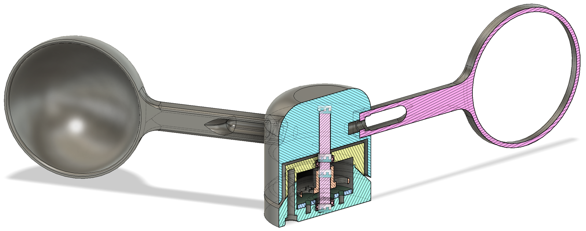 | 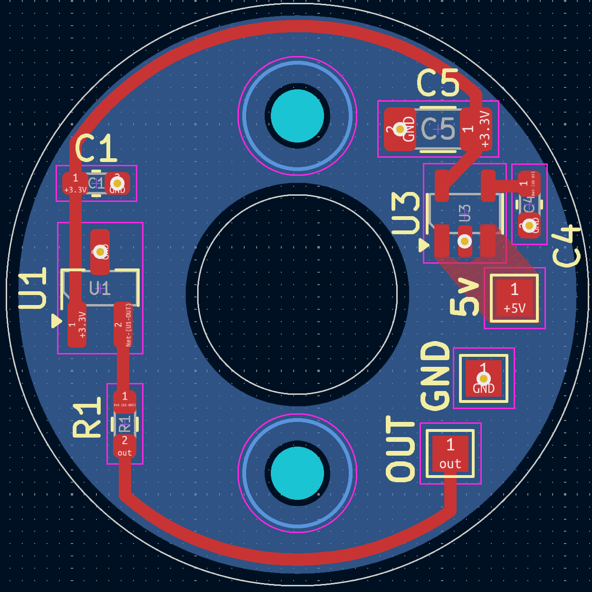 |

Three-cup rotor on a vertical shaft running in two stacked bearings, with the rotating magnet passing directly over a Hall sensor on a round PCB at the base of the housing. The board is the smallest one in the project: a 5 V to 3.3 V regulator (U3) with its decoupling, the Hall sensor (U1), a pull-up on its open-drain output (R1), and three pads — 5 V, GND, OUT. Output is a pulse train straight into one of the sensor board's binary inputs, so wind speed becomes a frequency count rather than another I²C device on the bus.

The board outline wraps the shaft bore, and the signal trace is routed the long way around the perimeter rather than across the centre, keeping it clear of the bore and the mounting holes. The housing overhangs the whole assembly so the bearings and electronics sit under a drip edge.

Not yet fabricated — the mechanical design is done, the electrical design is done, and the build was cut for time.

---

## Build

```bash
cmake -B build -DCMAKE_TOOLCHAIN_FILE=cmake/arm-none-eabi.cmake
cmake --build build
```

Flash with `st-flash` or an ST-Link through OpenOCD. The RAK3172 is configured through RUI3 APIs; the two STM32G030F6 slaves are flashed over SWD on the KAmod BlackPico headers.

---

## Repository layout

```
PowerManagementModule/     # STM32G030F6 — charger, BMS, Modbus slave
DataGatheringModule/       # STM32G030F6 — sensors, Modbus slave
TransceiverModule/         # RAK3172 — Modbus master, LoRaWAN uplink
hardware/                  # KiCad projects, Gerbers, BOMs
docs/img/                  # board renders and photos
docs/schematics/           # exported schematic sheets
```

---

## Authorship

Joint bachelor's thesis with **Jakub Wesołowski**, supervised by dr inż. Bartłomiej Wicher.

This repository covers the end device. My contribution: hardware design and PCB layout of all three boards, all embedded firmware and IC drivers, the Modbus RTU / RS-485 transport, the LoRa payload protocol, and the end-device integration with the ChirpStack network server (thesis sections 2 and 3.2–3.6).

The application layer — MQTT broker, InfluxDB schema, web interface and the Gradient Boosting prediction model (sections 3.1, 3.7 and chapter 4) — is Jakub's work.

---

## License

MIT for the firmware. Hardware files under CERN-OHL-P v2.
